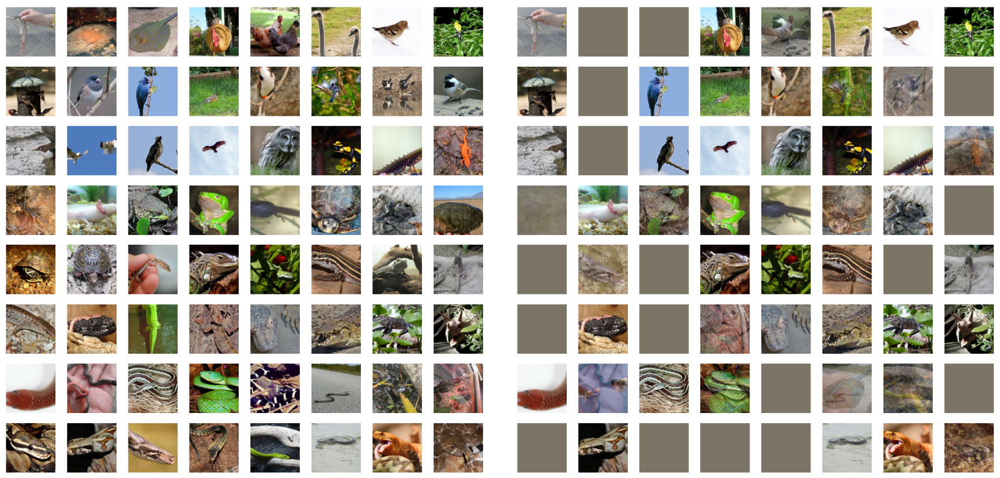

# Robbing the FED: Directly Obtaining Private Data in Federated Learning with Modified Models

This repo contains a barebones implementation for the attack detailed in the paper: 

```
Fowl L, Geiping J, Czaja W, Goldblum M, Goldstein T. 
Robbing the Fed: Directly Obtaining Private Data in Federated Learning with Modified Models. 
arXiv preprint arXiv:2110.13057. 2021 Oct 25.

```


*Batch of 64 ImageNet images reconstructed with imprint module containing 128 bins placed in front of a ResNet-18. Average PSNR: 70.94.*

### Abstract: 
Federated learning has quickly gained popularity with its promises of increased
user privacy and efficiency. Previous works have shown that federated gradient
updates contain information that can be used to approximately recover user data
in some situations. These previous attacks on user privacy have been limited in
scope and do not scale to gradient updates aggregated over even a handful of data
points, leaving some to conclude that data privacy is still intact for realistic training
regimes. In this work, we introduce a new threat model based on minimal but
malicious modifications of the shared model architecture which enable the server
to directly obtain a verbatim copy of user data from gradient updates without
solving difficult inverse problems. Even user data aggregated over large batches –
where previous methods fail to extract meaningful content – can be reconstructed
by these minimally modified models.


### Code: 

This barebones implementation was adapted from a larger FL attack zoo written by [Jonas Geiping](https://github.com/JonasGeiping). Thanks to him for the nice code :). This will be available soon and we suggest you check it out for a more thorough implementation of this particular attack, as well as others.

For this repo, the easiest way to get up and running is to play around with ```breaching_fl.ipynb```. This contains a start-to-finish imprint attack on a FL system. The guts of the imprint module can be found in ```modifications/imprint.py```. 

Requirements:
```
pytorch=1.4.0
torchvision=0.5.0
```